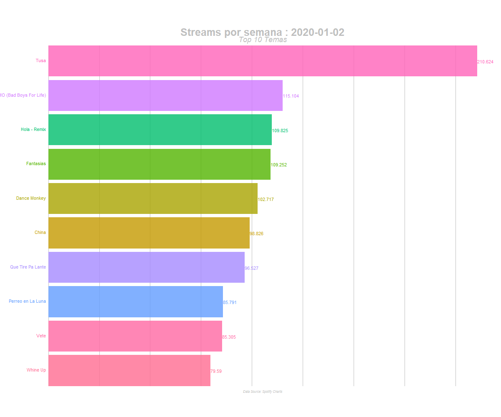

spotify-charts-scrap
====================

Hace ya algún tiempo con mis amigos teníamos la sensación de que la
cumbia si no muerta, estaba muy golpeada, siendo sustituída por otros
géneros musicales. Sin embargo, en los últimos meses me pareció sentir
un resurgimiento del género, incluso en su variante villera (dulce,
dulce variante villera). Es una sensación personal o realmente está
pasando?

Si bien con los datos que obtuve no puedo llegar a una conclusión - con
debilidades particularmente asociadas a la hipótesis rival de la
estacionalidad (la cumbia rebrota en verano) y el hecho de que estoy
tomando datos exclusivamente de Spotify (sin la más mínima idea de la
representatividad) - presento acá el proceso de análisis. Básicamente,
un ejemplo de scrapeo de [Spotify
Charts](https://spotifycharts.com/regional) y un ejemplo de `gganimate`.

Paso 1: scraping de Spotify Charts
----------------------------------

Clave dar crédito a quien lo merece. Este proceso fue básicamente una
réplica del proceso que aparece en este
[tutorial](https://datacritics.com/2018/03/20/scrape-it-yourself-spotify-charts/)

Primero: los paquetes

    library(rvest)
    #> Loading required package: xml2
    library(tidyverse)
    #> -- Attaching packages ---------------------------------------------------------------------- tidyverse 1.3.0 --
    #> v ggplot2 3.3.2     v purrr   0.3.4
    #> v tibble  3.0.3     v dplyr   1.0.1
    #> v tidyr   1.1.1     v stringr 1.4.0
    #> v readr   1.3.1     v forcats 0.5.0
    #> -- Conflicts ------------------------------------------------------------------------- tidyverse_conflicts() --
    #> x dplyr::filter()         masks stats::filter()
    #> x readr::guess_encoding() masks rvest::guess_encoding()
    #> x dplyr::lag()            masks stats::lag()
    #> x purrr::pluck()          masks rvest::pluck()
    library(magrittr)
    #> 
    #> Attaching package: 'magrittr'
    #> The following object is masked from 'package:purrr':
    #> 
    #>     set_names
    #> The following object is masked from 'package:tidyr':
    #> 
    #>     extract
    library(scales)
    #> 
    #> Attaching package: 'scales'
    #> The following object is masked from 'package:purrr':
    #> 
    #>     discard
    #> The following object is masked from 'package:readr':
    #> 
    #>     col_factor
    library(knitr)
    library(lubridate)
    #> 
    #> Attaching package: 'lubridate'
    #> The following objects are masked from 'package:base':
    #> 
    #>     date, intersect, setdiff, union
    library(tibble)
    library(gganimate)
    #> Warning: package 'gganimate' was built under R version 4.0.3
    library(gifski)
    #> Warning: package 'gifski' was built under R version 4.0.3
    library(av)
    #> Warning: package 'av' was built under R version 4.0.3

Luego preparamos los elementos necesarios para alimentar la función que
va a llevar adelante el scrapeo (para más datos mirar el tutorial en el
link)

    url <- "https://spotifycharts.com/regional/uy/weekly/"

    timevalues <- seq(as.Date("2019/12/27"), as.Date("2021/01/29"), by = 7)

    head(timevalues)

    unitedata<- function(x){
      full_url <- paste0(url, x, "--", x+7)
      full_url
    }

    finalurl <- unitedata(timevalues)

    finalurl <- head(finalurl, -1)

Con el paso anterior pronto (personalizado para el lugar y la fecha que
a uno le interese), es posible usar y reusar el código a continuación
para bajar datos específicos

    SpotifyScrape <- function(x){
      page <- x
      rank <- page %>% read_html() %>% html_nodes('.chart-table-position') %>% html_text() %>% as.data.frame()
      track <- page %>% read_html() %>% html_nodes('strong') %>% html_text() %>% as.data.frame()
      artist <- page %>% read_html() %>% html_nodes('.chart-table-track span') %>% html_text() %>% as.data.frame()
      streams <- page %>% read_html() %>% html_nodes('td.chart-table-streams') %>% html_text() %>% as.data.frame()
      dates <- page %>% read_html() %>% html_nodes('.responsive-select~ .responsive-select+ .responsive-select .responsive-select-value') %>% html_text() %>% as.data.frame()
      
      #combine, name, and make it a tibble
      chart <- cbind(rank, track, artist, streams, dates)
      names(chart) <- c("Rank", "Track", "Artist", "Streams", "Date")
      chart <- as.tibble(chart)
      return(chart)
    }

    spotify <- map_df(finalurl, SpotifyScrape)

Hecho esto, unas sencillas modificaciones de formato, para lo que va a
venir a continuación

    spotify_formatted <- spotify
    spotify_formatted$Rank <- as.numeric(spotify_formatted$Rank)
    spotify_formatted$Streams <- as.numeric(gsub(",", ".", gsub("\\.", "", spotify_formatted$Streams)))
    spotify_formatted$Date <- as.Date(spotify_formatted$Date, "%m/%d/%Y")

    spotify_formatted <- filter(spotify_formatted, Rank < 11)

Barras animadas
---------------

Luego, para poder usar esta información en una conversación casual que
como siempre, llevé a un extremo innecesario, necesitaba una
presentación atractiva, sencilla, y rápida. Por eso `gganimate` parecía
una excelente opción.

Lejos de ser un experto en esto, este fue mi primer intento, chupando
código de
[acá](https://github.com/amrrs/animated_bar_charts_in_R/blob/master/README.md)

    staticplot = ggplot(spotify_formatted, aes(Rank, group = Track, 
                                           fill = as.factor(Track), color = as.factor(Track))) +
      geom_tile(aes(y = Streams/2,
                    height = Streams,
                    width = 0.9), alpha = 0.8, color = NA) +
      geom_text(aes(y = 0, label = paste(Track, " ")), vjust = 0.2, hjust = 1) +
      geom_text(aes(y=Streams,label = Streams, hjust=0)) +
      coord_flip(clip = "off", expand = FALSE) +
      scale_y_continuous(labels = scales::comma) +
      scale_x_reverse() +
      guides(color = FALSE, fill = FALSE) +
      theme(axis.line=element_blank(),
            axis.text.x=element_blank(),
            axis.text.y=element_blank(),
            axis.ticks=element_blank(),
            axis.title.x=element_blank(),
            axis.title.y=element_blank(),
            legend.position="none",
            panel.background=element_blank(),
            panel.border=element_blank(),
            panel.grid.major=element_blank(),
            panel.grid.minor=element_blank(),
            panel.grid.major.x = element_line( size=.1, color="grey" ),
            panel.grid.minor.x = element_line( size=.1, color="grey" ),
            plot.title=element_text(size=25, hjust=0.5, face="bold", colour="grey", vjust=-1),
            plot.subtitle=element_text(size=18, hjust=0.5, face="italic", color="grey"),
            plot.caption =element_text(size=8, hjust=0.5, face="italic", color="grey"),
            plot.background=element_blank(),
            plot.margin = margin(2,2, 2, 4, "cm"))

    anim = staticplot + transition_states(Date, transition_length = 4, state_length = 1) +
      view_follow(fixed_x = TRUE)  +
      labs(title = 'Streams por semana : {closest_state}',  
           subtitle  =  "Top 10 Temas",
           caption  = "Data Source: Spotify Charts")

    #for gif
    animate(anim, fps = 10,  width = 1200, height = 1000, 
            renderer = gifski_renderer("gganim.gif"))

Y he ahí el GIF. Noble animal del disfrute, terriblemente transmutado
por un sociólogo con ansias de Data Science, en una herramienta
argumentativa.
